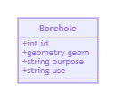
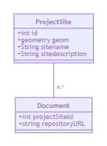
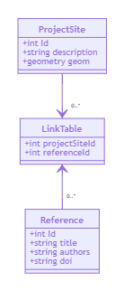

# Creating spatial data sets for EGDI

When you are making your spatial data ready for delivery to the EGDI platform you need to set up your data sets. As data can be set up in numerous ways we have tried to describe some guidelines below. The purpose of these guidelines is to ensure a uniform set-up through the system in order to make the end users have the same look and feel and functionality when browsing data from different projects.

It is up to the project to harmonise the data between the partners and to merge the data into one data set. It is recommended to add an attribute that tells which of the partners have delivered the different records in the data set.

The spatial data can be delivered in the following formats:

* [GeoPackage](/main-content/ListOfTerms#geopackage)
* [Shapefile](/main-content/ListOfTerms#shapefile)
* [NetCDF](/main-content/ListOfTerms#netcdf)
* [GeoTIFF](/main-content/ListOfTerms#geotiff)
* [Geocoded JPEG 2000](/main-content/ListOfTerms#geocoded-jpeg-2000)

The GeoPackage and Shapefile formats are for delivering spatial data as points, lines and polygons. The NetCDF is for delivering data in a grid format where each grid cell can contain several values. The GeoTIFF and Geocoded JPEG 2000 are for delivering geocoded images like scanned maps.

When you set up your data sets you should think of how the user will see them on the EGDI platform. Each data set can appear as a one or more layers on one or more maps. A very simple example could be a data set of boreholes with different purposes and uses. Your data set could then contain the following attributes:

With these attributes a layer could be defined that shows all boreholes where the boreholes are coloured based on their use. An alternative set-up of a layer could be a layer where only boreholes of a specific purpose are shown. It will also be possible to set up a layer where all boreholes are shown by default but where the end user can select from a drop down list (with all the used uses) which of the boreholes to show.

You must also think about the user experience for the end user. It can  be a good idea to combine several components into one data set. This could be analyses of different parameters from the same point. Instead of delivering the different measured components as separate data set they should be combined into one data set where one of the column define the type of measurement another the amount in standardised units.

## Projections

THe EGDI platform by default displays maps and data sets in projection EPSG:3034. If necessary, individual maps can be set up in other projections, but included data sets will then have to also support that projection or be able to be re-projected on the fly. On the fly re-projection can slow down the map and can also distort the details of images.

The EGDI platform by default delivers data sets as WMS in the following projection EPSG:4326, EPSG:4258, EPSG:3043, EPSG:3044, EPSG:3045, EPSG:25831, EPSG:25832, EPSG:25833, EPSG:32631, EPSG:32632, EPSG:32633, EPSG:32618, EPSG:32619, EPSG:32620, EPSG:32621, EPSG:32622, EPSG:32623, EPSG:32624, EPSG:32625, EPSG:32626, EPSG:32627, EPSG:32628, EPSG:3034, EPSG:900913 and EPSG:3857.

## Naming conventions

In order to make the system give the best user experience and make the system work in the same way for data delivered to EGDI by different projects it is important to follow naming conventions for specific fields. By doing this we can make the platform show fields with specific names in the same way across data sets. Also by naming fields containing URL's we can handle different types of URL's in different ways (for example opening a document in the document repository in a new window when clicking its URL or using fields named title as a title / heading in a pop up window showing the attributes of the table).

### General rules for naming data sets and fields

* Only use letters, number and '\_' (\[a..z\]\[0..9\]\[_\])
* Avoid special characters and national letters like æ, ö, é and so on
* Always start with a letter (\[a..z\])

### Data fields

| Field type | Field name in GeoPackage | Field name in Shape file |
|--------- | ------------------ | ------------------ |
| Title | title | title |
| Description | description | descriptio |
| Geometry | geom | geom |
| Keywords | keywords | keywords |

### Fields containing URL's

| URL type | Field name in Geopackage | Field name in Shape file |
|--------- | ------------------ | ------------------ |
| Link to document in repository | repositoryurl | reposiurl |
| Link to a map | mapurl | mapurl |
| Link to a layer on EGDI | maplayerurl | maplayurl |
| Links to metadata in the EGDI Metadata Catalogue | metadataurl | metadaturl |

If a data set contains several links to linked data, for example links to INSPIRE code lists and project vocabularies it is not possible to have a single name for the fields containing the URL. In this case you should have a field with the data and a following field with the same name and "_uri" as post fix.

|YOUNG_UNIT|YOUNG_UNIT_URI|FAULT_TYPE|FAULT_TYPE_URI|
|---------|---------|---------|---------|
|Pragian|<https://inspire.ec.europa.eu/codelist/GeochronologicEraValue/pragian>|detachment fault|<http://inspire.ec.europa.eu/codelist/FaultTypeValue/detachmentFault>|

## GeoPackages

GeoPackage is the preferred format in which to deliver data. In [GeoPackages](/main-content/ListOfTerms#geopackage) you can have long meaningful field names. Also GeoPackages are in fact small databases where you can have multiple tables with relations and in this way link multiple rows to one spatial object.

### Setting up data in a GeoPackage

When you are setting up data to be delivered to the EGDI platform there are some basic rules that must be followed:

* Only deliver one data set in a GeoPackage
* Combine each data set with a metadata entry in the EGDI Metadata Catalogue
* Keep the data in the GeoPackage in one theme - do not, for example, divide different types of geology in separate themes but add a feature to distinguish between them
* Only have one type of geometry in a data set. Do not mix points, lines and polygons.

When these rules are followed the data set can be presented as one layer and the theme can be filtered, for example based on geology, allowing the user to select which geology to show.

In order to get the best functionality on the EGDI platform you should follow the naming conventions described [here](#naming-conventions) this will ensure the best user experience for the end users of the data.

### Using relations

When delivering data as a GeoPackage it is possible to have more than the table with the geometry delivered in the same GeoPackage. This can be used to attach more that one element to the same geometry. This could, for example, be a list of documents attached to a polygon describing a project area.

This could be done using a model like the following where the table with the spatial data (ProjectSite) has a detail table (SiteDocument) where the links to pictures are located.

As indicated in this figure the table containing the spatial data should be given a name that is understandable and the table with related data should contain the name of the table it refers to.

Another example of using relations in your GeoPackage is a project that wants to add a list of references to articles to their project sites. This can be done using the model below.

In this example the spatial data about the project sites is contained in the table ProjectSite. The table reference contains all the references and the last table LinkTable links specific references to specific project sites.

## Shapefiles

[Shapefiles](/main-content/ListOfTerms#Shapefile) are, due to the limitations of the format, only suitable for delivering simple spatial data. This could, for example, be location of sites where the project has worked with a description of each site and perhaps a link to a single document in the document repository. For more complex data or data with links to INSPIRE code lists you should deliver data in the GeoPackage format.

In order to get the best functionality on the EGDI platform you should follow the naming conventions described [here](#naming-conventions). This will ensure the best user experience for the end users of the data.

## Gridded data

It is only possible to upload gridded on the [GeoTIFF](/main-content/ListOfTerms#GeoTIFF) format to EGDI. Data can also be delivered as [NetCDF](/main-content/ListOfTerms#NetCDF) files. These however mus be delivered to GEUS where the data will be loaded into the database by hand.

If the gridded data contains one value per cell the data should be delivered as a GeoTIFF or as a geocoded JPEG 2000.

If the data set contains more than one value for each cell the NetCDF format should be used. If you deliver data in the NetCDF format use the same [naming conventions](#naming-conventions) as for other data sets.

When you plan how to deliver raster data you should think about how they will appear to the user on the EGDI portal. Raster data delivered at GeoTIFF files will appear as separate layer on the portal. If you have several data sets on the same grid format and if these raster data belongs to the same data set you should deliver them as a NetCDF. They will then appear as one layer on the portal and the user can select which of the "layers" in NetCDF to display. If the raster data does not share the same grid layout they must be delivered as separate files.

## Examples of use

In this chapter there are some examples of how data can be used.

All spatial data sets uploaded to the EGDI platform can be made available as one or more layers (understand a layer as theme on a map that can be turned on and off and perhaps filtered by some of the attributes).

It is possible combine all the different types of spatial data and files uploaded to the EGDI platform. In this section you find descriptions of a few ways how this can be done.

This chapter will be extended with more examples and preferably with links to live data on EGDI.

### Simple layer based on a GeoPackage / Shapefile

When a [GeoPackage](/main-content/ListOfTerms#geopackage) or [Shapefile](/main-content/ListOfTerms#Shapefile) is uploaded to the platform it will be made available as a layer in EGDI. The layer can be thematised and filtered based on the values of the fields in the data set. The theme can contain Points, Lines or Polygons. This could be a data set of boreholes with water level measurements. The data set could contain information about the boreholes location and information about the use of the borehole, it's depth and the depth(s) from where water levels are measured. This could be shown as one layer with filtering options on the borehole use and the depth to the where the water levels are measured or as two maps one with shallow water level measurements and one with water level measurements from deeper reservoirs.

### Showing georeferenced documents on a map

You can generate a map layer that shows the location of all georeferenced files in the repository. It could be possible to filter on the different types of data files (e.g. documents, documents by reference, pictures\...). As in the previous example you could also make a layer with georeferenced documents and one with georeferenced pictures, both maps can be filtered by different types of metadata present for the different types of data.

### Linking documents to polygons or points on a map

If your project has pilot areas, these can be defined in a spatial data set. You can add link(s) to reports stored in the document repository describing the different pilot areas from the spatial elements defining the different pilot areas. When uploaded to the EGDI platform the pilot areas can be shown on a map layer and the reports will be accessible from the map together with information about the pilot area when the user clicks on a pilot area.

### Using images stored in the repository to display cross-sections through a model

Images / PDF files can be used to show computer generated / hand drawn profiles from a geological model. To do this you must create a spatial data set with lines / polylines defining the location of the separate profiles. Each profile line in the data set must have added a link to profile in the data repository. When the spatial data set is uploaded to EGDI it can be shown on a map layer. When the user clicks on the profile line information about the profile is shown including a link to the picture / pdf with the profile.

### Using linked data

It is possible use linked data and project vocabularies to give easy access to descriptions of spatial objects shown on the map. In this way it is possible to show information about a fault and give easy access to other faults in the same fault system. A prototype can be seen here:

<http://egditest01.geus.dk/egdi/?mapname=egdi_geoera_muse#baslay=baseMapGEUS&optlay=&extent=3659870,2027340,5025520,2702340&layers=muse_vienna_basin_fault_system>

When you click the Vienna Basin Fault System you get information about this specific fault system, but will also be able to see the faults within the fault system and to navigate to Mur-Mürz-Vienna Basin-Vah Large-scale Fault System to which the Vienna Basin Fault System belongs.

<https://thesaurus.geolba.ac.at/?uri=http://resource.geolba.ac.at/structure/190>

## Document Details

### Report

Authors and affiliation: GEUS

Name(s): MH

Report Name: EGDI Administration Module

Work package: WP6 and WP7

E-mail of lead author: mh@geus.dk

Version: 20/10/2020

This report is part of a project that has received funding by the European Union's Horizon 2020 research  and innovation programme under grant agreement number 731166.

Report Status: Under development
