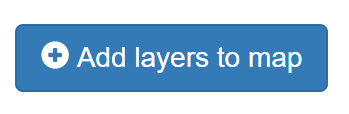
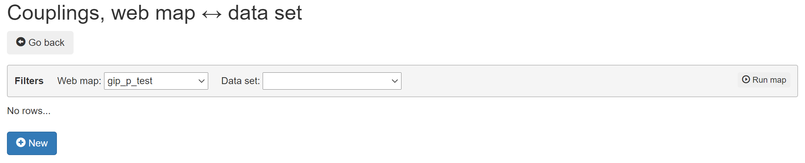
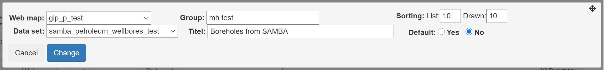
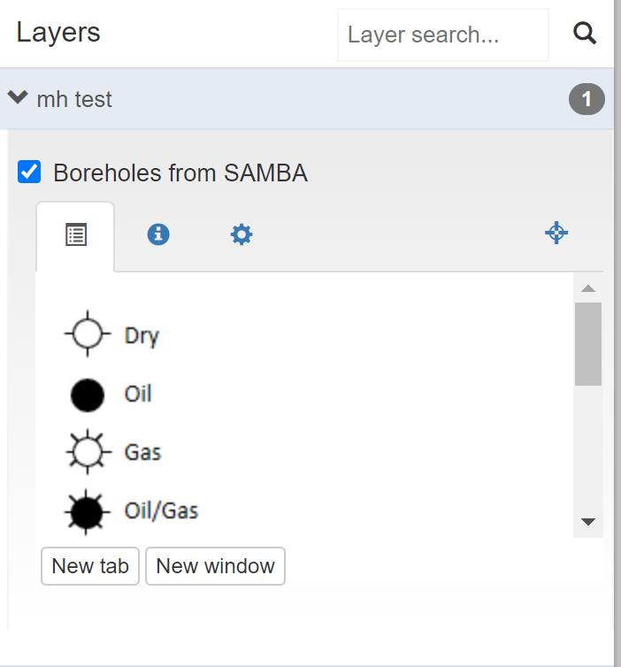

# This file is just for testing

Create the view:

```sql
CREATE VIEW DataView AS
select * from DataDa
union
select * from DataDe```
```

```txt
dette er ren tekst
```

```html
<h1>dette er html</h1>
```

```xml
<b>dette er xml</b>
```

```java
for (i=0;i<10;i++) {
  system.err.println("Fejl " + i);
}
```

## Old text

To add layers to your map you can edit your map and select click the “Add layers to map” button


From this page you can add layers to the map by clicking the “New” button.




In the pop up that appears give a name to the group of layers you want your layer to appear in. Select an existing layer like the samba_petroleum_wellbores_test, give it a title and press the “Create” button. If you go back to the map you can see a group layer called “mh test”. This group contains a layer called “Boreholes from SAMBA”


