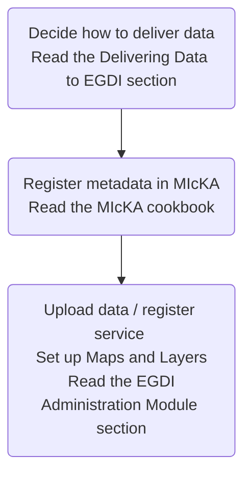
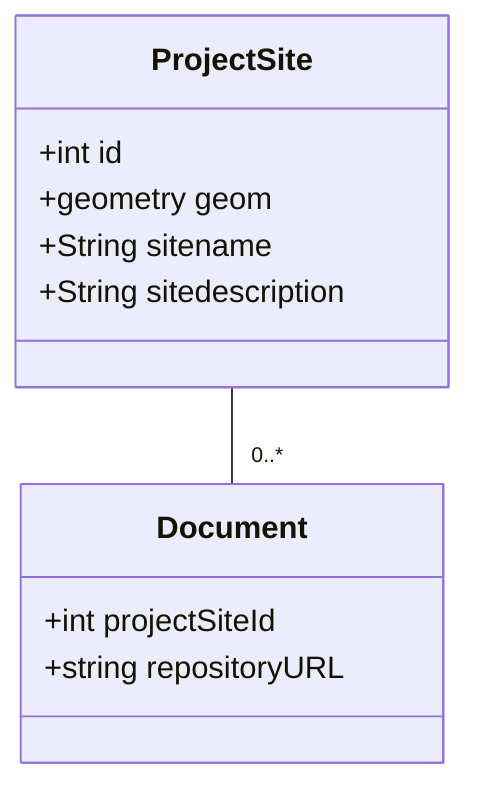
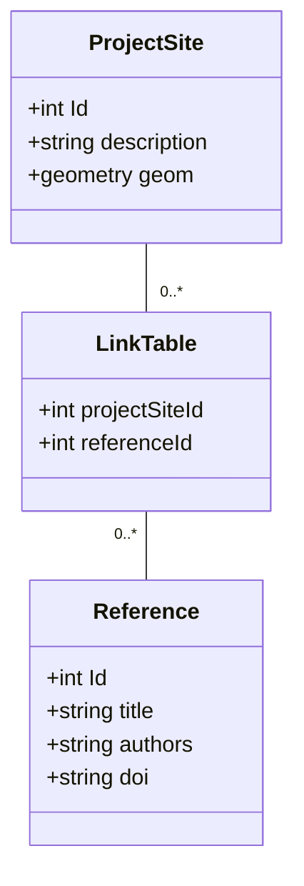
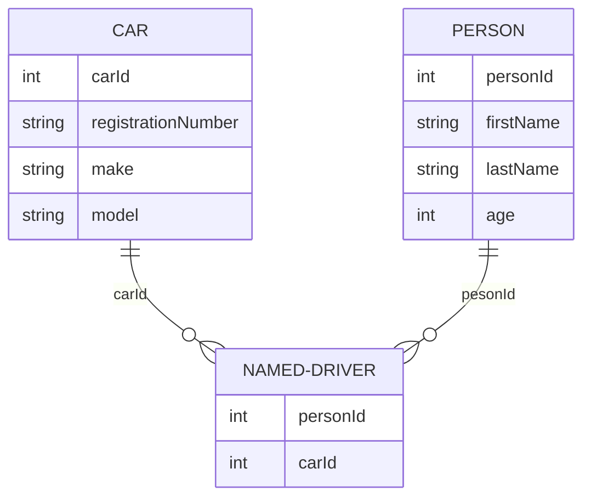

# Data Work flow

This file contains the source code for diagrams in mermaid syntax. The code can be transformed to images here:

[Mermaid Live Editor](https://mermaid-js.github.io/mermaid-live-editor/)

We could install the Mermaid plugin so that the code is automatically converted to diagrams.

