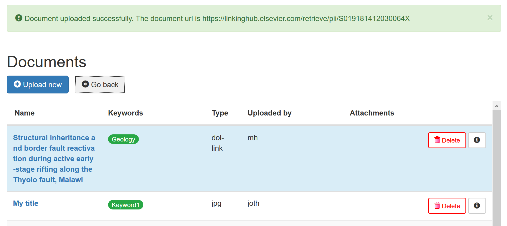

# General Introduction

Upload of data and the configuration of maps and map layers are done through the EGDI administration module. Please not that **This document is under development and some of the features described are only available on the EGDI test platform.**

From the administration module it is possible to:

* Upload unstructured data as:
  * PDF
  * References to documents by DOI
  * Picture and
  * CSV (comma separated files)
* Upload spatial data in a:
  * GeoPackage
  * Shape files
  * GeoTIFF
  * NetCDF **must be sent to Martin Hansen & Jørgen Tulstrup at GEUS**
  * Uploading 3D models **must be sent to Martin Hansen & Jørgen Tulstrup at GEUS**
* Upload geological models from:
  * LeapFrog
  * GoCad
  * Petrel
  * GeoScene3D
* Set up new maps and edit existing maps **not very user friendly**
  * Define layers
  * Add layers and groups of layers to maps

Before adding data to EGDI you must add a metadata entry in the EGDI Metadata Catalogue (MIcKA) describing the data set. Detailed guidelines on how to proceed are available in the MIcKA Cookbook (<https://czechgeologicalsurvey.github.io/MICKA-Docs/mickacookbooklite.html># ) and at EGDI Metadata Profile detail description (<https://czechgeologicalsurvey.github.io/MICKA-Docs/EGDIProfile.html>#). **You will not be able to add spatial data sets or services to EGDI without providing a link to its metadata entry in the EGDI Metadata Catalogue**.

When entering your metadata in the EGDI Metadata Catalogue remember to add the name of the project to which the dataset belongs. This is important as this will your projects data easier to find.

## Getting a user account

To deliver data to the EGDI platform you will need a username and password for the administration module. To get this your project lead has to send an email to EGDI (contact@europe-geology.eu) requesting a user account. Your project lead must supply full name, email address and to which project you belong (a account can be connected to more than one project).

## Accessing the administration module

You can find the administration module here:

<https://data.geus.dk/egdiadmin/login.jsp>

For testing purposes we have a test version of the administration module here:

<http://egditest01.geus.dk/egdiadmin/login.jsp>

When you logon to the administration module you must have a username and a password and if you work for more than one project, you must also supply a project name. When you get a user account this will be assigned to one or more project. All the data that you upload will be assigned to this project and can be changed by all users assigned to the project.

If you are working for one project only you don’t have to supply the name of the project.

When you have logged in to the administration module you can:

Upload unstructured data to the EGDI document repository:


Upload new data sets


Maintain web maps, data sets and the couplings between layers and maps.


How these are done is described in the chapters below.

## Delivering unstructured data

The EGDI platform has a document repository. This repository is for storing different types of files and makes these files available for the users. The files can be PDF files, pictures and CSV files. The files uploaded to the repository will not be integrated into the platform but will be made available as is. Data that needs to be integrated into the system must be delivered in GeoPackages together with the spatial data they refer to.

When you upload unstructured data to the EGDI portal you must supply metadata for the file. This metadata will be used for searching through the data. Unlike the metadata for spatial data sets, 3D models and services the metadata for unstructured are stored at the EGDI portal.

It is also important to know that all documents uploaded to the EGDI platform are publicly available. You must therefore make sure that you don't violate any copyright restriction when you upload documents to the platform.

All documents uploaded to the EGDI Document Repository get a unique static URL a URI. You can can refer to this URI from your spatial data, from home pages and form other documents.

The EGDI document repository can be searched using the [EGDI Repository Search Platform](https://search.europe-geology.eu/). This tool allows you to search through metadata for pictures and CSV files and metadata and content of pdf-files.

To search through the test repository use the test version of the [Repository Search Platform](https://www.geo-zs.si/db/egdi-search/)

### Naming conventions

When you upload documents to the document repository. You must follow the same rules as when you upload datasets. these rules are:

* Only use letters, number and ‘_‘ ([a..z][0..9][_])
* Avoid special characters and national letters like æ, ö, é and so on
* Always start with a letter ([a..z])

### Licences

When you upload files to EGDI document repository it possible to add a licence to the data. In EGDI the licences that has been agreed upon are the the six Creative Commons license types and full open source. When yor register metadata for a dataset in the EGDI Metadata Catalogue you can also assign one these licenses to your dataset.


CC BY: This license allows re-users to distribute, remix, adapt, and build upon the material in any medium or format, so long as attribution is given to the creator. The license allows for commercial use. CC BY includes the following elements:

* BY – Credit must be given to the creator


CC BY-SA: This license allows re-users to distribute, remix, adapt, and build upon the material in any medium or format, so long as attribution is given to the creator. The license allows for commercial use. If you remix, adapt, or build upon the material, you must license the modified material under identical terms. CC BY-SA includes the following elements:

* BY – Credit must be given to the creator
* SA – Adaptations must be shared under the same terms


CC BY-NC: This license allows re-users to distribute, remix, adapt, and build upon the material in any medium or format for non-commercial purposes only, and only so long as attribution is given to the creator. It includes the following elements:

* BY – Credit must be given to the creator
* NC – Only non-commercial uses of the work are permitted


CC BY-NC-SA: This license allows re-users to distribute, remix, adapt, and build upon the material in any medium or format for non-commercial purposes only, and only so long as attribution is given to the creator. If you remix, adapt, or build upon the material, you must license the modified material under identical terms. CC BY-NC-SA includes the following elements:

* BY – Credit must be given to the creator
* NC – Only non-commercial uses of the work are permitted
* SA – Adaptations must be shared under the same terms


CC BY-ND: This license allows re-users to copy and distribute the material in any medium or format in unadapted form only, and only so long as attribution is given to the creator. The license allows for commercial use. CC BY-ND includes the following elements:

* BY – Credit must be given to the creator
* ND – No derivatives or adaptations of the work are permitted


CC BY-NC-ND: This license allows re-users to copy and distribute the material in any medium or format in unadapted form only, for non-commercial purposes only, and only so long as attribution is given to the creator. CC BY-NC-ND includes the following elements:

* BY – Credit must be given to the creator
* NC – Only noncommercial uses of the work are permitted
* ND – No derivatives or adaptations of the work are permitted


CC0 (also known as “CC Zero”) is a public dedication tool (a legal tool designed to waive as many rights as possible), which allows creators to give up their copyright and put their works into the worldwide public domain. CC0 allows re-users to distribute, remix, adapt, and build upon the material in any medium or format, with no conditions.

You are not required to add a licence to the files you upload.

### Language

You are also asked to enter a language code for the uploaded document. For this you must use the [ISO 639-1 code](https://en.wikipedia.org/wiki/List_of_ISO_639-1_codes)

### Spatial coverage

During the upload of unstructured data you can include a spatial reference. This must be given either as a point or a bounding box in WGS84 (degree). For points you must enter latitude, longitude for example

```text
13.972990, 46.410586
```

For bounding boxes you must enter minX, maxX, minY, maxY where latitudes (Y) are = 90 to -90 and longitudes (X) are = 180 to -180) for example

```text
13.972990, 14.099221, 46.410586, 46.468877.
```

### Delivering documents

Documents can be delivered as files where you upload a pdf file or by reference where you register a DOI that links to a document that might / might not be freely available.

When uploading a pdf file you must make sure that this is not against any copyright on the document. All files uploaded to the EGDI platform will be publicly available. Any restriction on the use must be stated in the document. Documents must be delivered in the pdf format.

#### Delivering PDF files

To upload a pdf document you must click on the link “Upload documents / images”.


The required metadata for pdf-files are:

* Title
* Abstract
* Keywords
* Created date
* Authors
* Language

When uploading pdf documents you drag the pdf-file to the to the administration module. If you check the include attachments checkbox an area to drag attachments to will appear below the area to drop the document. When the file has been uploaded the document will been given a static URL. The URL will include a link to the EGDI repository, the name of the project and its filename like:

<http://egditest01.geus.dk/egdidocs/”project-name”/”file-name>”

Some URL unfriendly characters changed to ‘+’. A document named “Test document.pdf” uploaded by a member of the GIP project will get the URL <http://egditest01.geus.dk/egdidocs/gip_p/test+document.pdf>

In the production system (not operational yet) the document would get this URL:
<https://repository.europe-geology.eu/egdidocs/gip_p/test+document.pdf>

During upload the system will check if a document with the same name or content already exists in the repository. If this is the case the user can replace the existing document.

When the document has been uploaded to the platform you will be directed to the metadata entry. If the document contains metadata these will be shown on the screen. There are fields for Title, Abstract, Keywords, Creation date, Authors, language and spatial coverage. The fields marked with an * are mandatory.

When the document is uploaded you will get a static link (URI) to document.


When we save a pdf in the EGDI Admin - we both save to the standard pdf fields (if any is present), but also to our own custom fields in the XMP header.

So for “abstract” (for example) - we both save the value to two “standard pdf fields”: “subject” (in the pdf-standard-header) but also to “description” (in the standard Dublin-core-header).

These are the values you will se in Adobe when you press properties in a pdf document.

But we also save “abstract” to a custom field in XMP-header which we also call “abstract”. You see this in Adobe if you navigate to the “user defined tab” on properties for the document.

The reason we do this is – the standard fields are needed so that the pdf metadata displays correct in the users viewer (Acrobat reader / chrome / FireFox etc.).

But we also need the custom field “abstract”, so that solar knows what metadata to index (that the user can search for).

Also some of the standard fields have some limits (size), so not to loose details (etc when a document is re-uploaded to the EGDI Admin) - we save a copy to our own custom field (where there are no such limits).

So abstract is actually written to three fields (two standard and one custom).


We haven't developed a editing functionality for pdf-files. The metadata you enter are however written into the pdf-file, so if you want to correct the metadata download the pdf-file and reupload it once more then you only have to add your changes. When you upload the document the second time check toh overwrite checkbox.

#### Delivering documents by reference

If you have scientific papers that are not publicly available that you want to link to, you can create a reference to the paper through its DOI.

You go to "Upload documents / images/ doi in the administration module.

Then select that you want to register a DOI in the drop down list.


When you select to register a DOI you are prompted for the DOI

Add the DOI and when you hit the save button the DOI is parsed and the metadata are read from the DOI and the fields for metadata are pre filled with these metadata so you only need to add the metadata that could not be extracted from the DOI.

The required metadata for DOI are:

* Title
* Abstract
* Keywords
* Created date
* Authors
* Language

Besides these required metadata you can also add a spatial coverage for the document.



### Delivering pictures

Delivering pictures to EGDI is much as delivering documents.


When the registration is finished you are, as with pdf's and images, directed to the list of documents in the repository belonging to your project.

The required metadata for pictures are:

* Title
* Abstract
* Keywords
* Created date
* Authors

### Delivering CSV

If you want to deliver some data that has been used during your project that can be of value for others, you can deliver these data as comma separated files (CSV). These data will not be visualised on the platform, but will be made available for download as they are.

When uploading a CSV file you have to give the same metadata as for documents and pictures and when finished you are forwarded to your projects document list with the static link (URI) to SCV file


The required metadata for cdv-files are:

* Title
* Abstract
* Keywords
* Created date
* Authors

## Delivering spatial data

Spatial data can be delivered to the EGDI platform by upload of GeoPackages, Shapefiles (for simple data), GeoTIFF files (for one layer raster data) or by registering a service that delivers the data (WMS or WFS). Before delivering spatial data to EGDI a metadata entry describing the data set must be added to the EGDI Metadata Catalogue.

The data must also be harmonised within the project and if the data from several partners should be shown on one map the data must be combined into one data set.

The dataset must also be delivered in the correct [projections](/main-content/SpatialData.md#projections) and using the naming [convention's](/main-content/SpatialData.md#naming-conventions) described in this user guide.

Read the section about [how to set up spatial data sets](/main-content/SpatialData.md) before you start to create your data sets for the EGDI platform.

The EGDI portal supports the following geometry types:

* wkbPoint
* wkbMultiPoint
* wkbPoint25D
* wkbLineString
* wkbMultiLineString
* wkbMultiPoint25D
* wkbPolygon
* wkbPolygon25D
* wkbMultiPolygon
* wkbMultiPolygon25D

The EGDI platform treat the three Point geometries as Points, the three Lines geometries as Lines and the two Polygon geometries as Polygons. In other words data delivered as for example wkbPoint, wkbMultiPoint and wkbPoint25D are treated in exactly the same way.

### Upload GeoPackages

GeoPackages are the best way to deliver data. A GeoPackage is a small on file database (SQLite) that allows you to include more tables in a single GeoPackage. See the section [Working with GeoPackages](/main-content/GeoPackageExamples.md) how to set up you data in a GeoPackage.

When you are going to upload a GeoPackage you also need to have a valid metadata entry in the EGDI metadata catalogue before you can upload the GeoPackage. Right now the administration module supports upload of simple GeoPackages that only contains one spatial. In our test environment we are currently working on upload of GeoPackages with multiple spatial element, views and several stored thematisations.


Please note that the current version of EGDI does not handle spatial elements with an z-dimension. You can see if a GeoPackage has an z-dimension by opening the GeoPackage from SQLiteStudio and looking in the gpkg_geometry_columns table. If it looks like this with zeros in the z and m columns:


It will work. If it has a z-dimension it will look like this:


It will not work.

### Upload Shapefiles

Shape files can only be used for simple data as a shapefile can contain only one table with data and geometry.


### Upload GeoTIFF

When you have created a GeoTIFF in the right projection you go to the administration module and click on Upload GeoPackage / GeoTIFF files link.


When the GeoTIFF has been uploaded you must select which of the bands to use, give name to the layer (select one that the user can understand) and select which map add the layer to.


If all works as intended you should get a preview of the GeoTIFF like this:


Se the section [Setting up colouring for GeoTIFF](#setting-up-colouring-for-geotiff) to learn how to set up the thematisation for GeoTIFF.

## Finding a layers resource URI for metadata

If you want to add a resource URI to the layers metadata record. You can follow this procedure:

Create a URL like this: <https://data.geus.dk/egdi/?mapname=egdi_geoera_hotlime#layers=hotli1>

Where you replace "egdi_geoera_hotlime" with the name of your map and replace "hotli1" with your layers name. Put this URL in the weblink of MICKA.

### Register a service

This description is **coming later**.

## Uploading 3D models

The **upload functionality for 3D models are not yet available**. Right now models can only be loaded into EGDI by GEUS. We are working on an extension to the administration module to make this possible for the users.

Currently the following formats are supported:

* Raster file formats
  * *.asc
  * *.grd
* Tin file formats
  * *.obj
  * *.ts
* Voxel file formats
  * *.xyz

These formats makes it is possible to (at least) import models developed in GoCAD, LeapFrog, Petrel and GeoScene3D. The list of formats from which a model can be imported from and exported to will be expanded with time.

## Configuring maps and layers

Each project can define as many maps as they like. On each map different layers can be combined into groups and sub groups. In this way you can create a hierarchy of layers on the map. Each layer can be turned on and off and the transparency can be changed by the user. The EGDI maps are running in a test environment:

<http://geusegdi01.geus.dk/egdi/?mapname=egdi_test>

And in a production environment:

<https://data.geus.dk/egdi/?mapname=egdi_test>

When you upload spatial data to EGDI the data are automatically added to a preview map. This map is named af your project. For example the preview map for the GIP-P project is named:

```html
https://data.geus.dk/egdi/?mapname=gip_p_preview
```

And in the test environment:

```html
https://egditest01.geus.dk/egdi/?mapname=gip_p_preview
```

### Defining layers

A layer is usually defined during upload of a data set or the registering of a service. It is however also possible to create layers based on data already uploaded to the EGDI platform.

After uploading your data it is possible to change the layer configuration customise the descriptions, adding a legend and setting up the thematisation. All this from the "Data set" part of the administration module. **Part of this setup is rather advanced so proceed with care and use the test system for practising!**

#### Adding descriptions to the layers

The description you can add in the Description field is a short description the layer. this description is used to easier locate the layer in the long list of layers at EGDI.


Here you see the description in the list of layers. This is also searchable using the free text filter at the top of the list. Giving a good short description of your layer also help other users to locate it.


In the "**Data set welcome HTML**" box you can write a description of the layer to the user. This description can be a simple description like this:


#### Adding legends to the layers

To add a legend to a layer you must edit the layer, scroll dow to the Legend part of the layer definition.


Here you can upload a pre generated image with a legend. When the legend has been added you can see it in the layer definition part.


#### Linking to a document in the repository

You can link to a document that are stored in the document repository from layer text in the "Data set welcome" box where you also can give further information about the layer.

```html
<h1>Base horizon of something</h1>
<p>This layer shows something you can read about in this <a href="https://egditest01.geus.dk/egdidocs/gip_p/test.pdf" target="_blank">document</a></p>
```


#### How to add images

As yo can see on the sample above it is also possible to add images to the description. This can be done en two ways

 1. By linking to the image or
 2. By adding the images as base64 encoded text

While the first method is more easy the second is more safe as the image is stored on the EGDI platform and not relying on an external image to present.

To add an image as base64 encoded text add the following html and add the base64 encoded image after the "," on the first line.

```html

```

A base64 encoded image looks something like this:

```txt
iVBORw0KGgoAAAANSUhEUgAAACQAAAAkCAYAAADhAJiYAAAAAXNSR0IArs4c6QAAAAZiS0dEAP8A/wD/oL2nkwAAAAlwSFlzAAAN1wAADdcBQiibeAAAAAd0SU1FB9sMDBMsFXGHhpkAAAPiSURBVFjD3ZdPaBxVHMc/v/fezOxuNqZpNqWthGIqHloaCW1pIynaiP8OYhEKHqWiWBA8eNGCCp49eFDUq1AvUpBEiRiskICHUlCh1iBtLYUkhZDE0DTb7e68n4fZCeM2rZjdNMGBx29mmHnz4fv7zvu9H/zfjp+go5XzmWYnWIBnNxVQDd7aNEBjkPdwYAT6NgVQGZ4SEA/PbDjQCAhwzAAWnj+TXG8cUAjOwnEHODiyBR7cUCAP71soBgkQAqdbASRrNPMOD9M2SRfW2mSiOB46Aj9uhELvOSBIh7WE+bwG1r490aSX/jPQWegy8IoDrfsHp0qUzxNE0dN5OHRfgTycsRBYEFsHsnGMs1ZyHR1YY0bvG9AYnDDw+D/UAQLvsbdvE5ZKGhaLW36FD9cdaAweEDhlQS1IFsgBbnmZMAwl39OjgXOvXYCd6wrk4QOB3WmqbAOQqVQwN2+S6+2VsLu7XUS+Wjeg0cSob1pQk4FJYwAEqsjsLK5YpLBvnwZR9Nhv8HrLgb6B0MPHJnlYbP0l05gywC4uIlNT5Pbulai3VwXevQDFlgIpPAcckPrDaVwtba5WQy9dwjpH2+CgBJ2dOxXeaRnQDxDG8GUWRjIK2UxMS4iZnUWvXCHav598fz/GuVO/wCMtAVqCjwQKAkoGphHKZbzkqlX85CQmDCkMDanr6kLh06aBhqGkcAxQAZGMQtKgVhbKAszM4K9dI+rvl9yePSrGHD4PDzer0IDCjsYCfDcol0khS0vEly9jSyXyBw+KaWsreHipKSCFl9e6ddBajXhqCuKYqK8Pt20bCieaBTp6l/srMR0+2exTq5+r98SLi+jyMq6nB9fdrQoPNZuyzvT7ugpAGj0Q12Gq9aiAVipotYppb8e0t4uKNP2XzQOi91BFMzDpSK+9MWAMGseo96ot+O1/zqapUZVUmXRUs1AiaKEAUUQ8N0d1fl686l9NAQl8nSmsd8BkgWqNKhmDlEoQRZQvXqQyM1NfSf79cPeqqQJlhZwmvdcdMCajYLpgekCjCLNrF7WFBW6Mj2tlbk6Az5tSqAh/AuN1H2kK4RtUWU0hv3Ur0tXF0sQEN86dE1+t/p61wJqAngSfry9mChKv4ptGkCpQE0E7Orh19SoLIyNavn4dhVcHodySNmgYnojhewtBCBqCBJmOI636K4uiMdjt2zV2jvL0tMS12hsD8ElL+7JhOKpw1iUd60plDzLlIusnby01Vbz3Jwfgs3VpFL9NmsMvgmSTHwSZomoaJorhPHDycBLXr3P9DpzCbgcvGnjBwaMGchaqApMCo8BpgT8Owa217Kn/BmpwYnIdru5dAAAAAElFTkSuQmCC
```

You can Base64 encode images using this online tool from [base64encode.org](https://www.base64encode.org/).

#### Setting up colouring for GIS themes

The following definition will show the points as red (RGB=255,0,0) circles and the labels (taken from the field "type") are written in in black in a bold ariel font centeret above the circle.

```text
 DATA "wkb_geometry FROM (SELECT * FROM project_gip_p.dataviewmh) AS t USING UNIQUE ogc_fid SRID 3034 FILTER"
 LABELCACHE on
 CLASS
  STYLE
   SYMBOL "circle"
   SIZE 4
   COLOR 255 0 0 
   OPACITY 100
  END
  TEXT "[type]"
  LABEL
   FONT arialbold
   TYPE TRUETYPE
   SIZE 8
   OUTLINECOLOR 175 175 175
   COLOR 0 0 0
   POSITION uc # upper-center
  END
 END
 ```

This styling will look like this


To define colours for different classes based on the content of your data you can add an expression like the following to the SQL in the MapServer definition.

```text
   CASE
    WHEN f.genetic_ty IN ('Sedimentary-hydrothermal') THEN '242 227 131'
    WHEN f.genetic_ty IN ('Greisen') THEN '239 193 121'
    WHEN f.genetic_ty IN ('Rare metal granite') THEN '228 181 212'
    WHEN f.genetic_ty IN ('Pegmatite-aplite') THEN '249 168 112'
    ELSE '255 255 0'
   END rgb_hidden,
```

In this case the objects are coloured based on the content of the field "genetic_ty". The colours must be given as a string whit a red, green and blue component all ranging from 0 to 255. You must supply the colours for all possible values in the field or as in the example add an ELSE clause that gives all the records not in the list the colour '255 255 0' (yellow). The information will be stored in a field named rgb_hidden. Due to the '_hidden' postfix the field will not be shown in the click info.

To tell MapServer to use this field to colour your data use the following style setup to make the data points have the colours stored in the hidden field rgb_hidden.

```text
STYLE
  SYMBOL "circle"
  SIZE 6
  COLOR [rgb_hidden]
  OPACITY 100
END
```

This styling will look like this on EGDI:


#### Setting up colouring for GeoTIFF

GeoTIFF on EGDI are coloured based on the values of the different cells. The following defines that the GeoTIFF should be coloured from white (RGB = 252, 521, 253) to purple (RGB = 63, 0, 125) and that the data range of the GeoTIFF are from 1 to 664.

```text
 CLASS
  EXPRESSION ([pixel] >= 1 AND [pixel] < 665) 
  STYLE 
    COLORRANGE 252 251 253 63 0 125  #color start RGB and end RGB
    DATARANGE 1 664
    RANGEITEM "pixel" 
  END #STYLE
 END #end class
```

This styling will look like this:


You can make more complex colouring by combining two or more COLORRANGE's.

This example colour a GeoTIFF with values between 0 and 500 from red to yellow and to green where 0 equals red 250 yellow and 500 green

```text
CLASS
  EXPRESSION ([pixel] >= 0 AND [pixel] <= 250)
  STYLE
    COLORRANGE 255 0 0 255 255 0  #color start RGB and end RGB
    DATARANGE 0 250
  END #STYLE
END # class
CLASS
  EXPRESSION ([pixel] >= 250 AND [pixel] <= 500)
  STYLE
    COLORRANGE 255 255 0 0 255 0 #color start RGB and end RGB
    DATARANGE 250 500
  END
  END #class
  ```

This styling will look like this:


#### Adding filtering on data

In HTM section it is also possible to define filtering of data. If this is done the end user can filter the data and select which of the data to show. A very simple filtering based on the content of two different fields from the data set can be made like this.

```html
<div class="english" style="display:none;">
<table>
<tr>
 <td align="right">Point type</td>
 <td>
  <select name="type">
   <option selected value="">All types</option>
   <option value="A">A</option>
   <option value="B">B</option>
   <option value="C">C</option>
  </select>
 </td>
</tr>
<tr>
 <td align="right">Country</td>
 <td>
  <select name="country">
   <option selected value="">All countrys</option>
   <option value="da">Denmark</option>
   <option value="de">Germany</option>
  </select>
 </td>
</tr>
</table>
</div>
```

This code creates two dropdown lists where the user can select only to show the data point of type A, B or C and from which county. For both lists default values has been selected ("All types" and "all Countrys").


It also possible to make other types of filtering. To do numerical filtering you must add a special field to your query ending with "_num". The fields ending on "_num" will not be shown in the click info so if you want to include the value in the click info you mist include it twice in the select statement in the MapServer definition.

```sql
SELECT *, ph AS depth_num
```

This will include all the fields of the data set in the click info and also generate a hidden field to filter after.

For numeric field you can use minimum and maximum filtering like this:

```html
<tr>
 <td align="right" style="white-space:nowrap;">Well depth</td>
 <td><input type="number" maxlength="4" name="depth.min" value="" size="4"> -
 <input type="number" maxlength="4" name="depth.max" value="" size="4"></td>
</tr>
```

Producing two fields where min. and max. values can be added.


If you have text fields you can also do the filtering on this

```html
<tr>
 <td align="right" style="white-space:nowrap;">Locality name</td>
 <td><input type="text" name="locality.part" value="" size="8" title="Looks for all localities containing the text"></td>
</tr>
```

Here the locality.part instruct the filtering to looks for all localities with the supplied text as part of its name. At hte same time a "on mouse over" help text is added telling the user that it will "Looks for all localities containing the text".


#### Defining a layer based on an existing layer

If you have delivered a complex data set to EGDI it might be a good idea to show it as different layers. This can be done by copying your first layer and then change the SQL that defines which fields to show, the thematisation and the filtering.

You copy a layers definition from the "Data set" part of the Administration Module and hit the "Create new" button.


This will create a copy of the original layer (by default named "original_layer_name"_copy) with all of its definitions.

### Setting up a new map

Each project can define as many maps as they wish. One good reason to create several maps for a project could be that the project works in small areas placed across Europe. In this case a first map showing the location of the project areas and then separate maps showing data for the different project sites.

If a map is given the unique map name gip_p_preview the map can be accessed through the following URL:

```html
https://egdi.geus.dk/egdi/?mapname=gip_p_preview
```

And this URL in the test system:

```html
https://egditest01.geus.dk/egdi/?mapname=gip_p_preview
```

The preview map is pre-generated the first time a dataset are uploaded to the EGDI platform. All datasets uploaded to the platform will automatically be added to the preview map.

When you create a map you must at least:

* Give the map a unique name. This name will be part of the URL to the map
* Give the map a title
* Set the coordinate system (the EGDI default coordinate system is EPSG:3034)
* Set the extend of the map
* Write an introduction to the map. This introduction must be written in HTML


When defining the extent of the map you can click on the "Europe" button to set the extend to match Europe. Ef you want to use a different extend the easiest way to get it, is to zoom in to the area you want on an existing map and the take the extend from the URL and use that.


A the sample map below. The unique map name is marked with red, the title of the map with blue and the title with green.


So far the map generated contains no layers. See [Adding layers](#adding-layers-to-a-map) to a map for how to add layers.

### Adding layers to a map

Now you are ready to add layers to your map.

Before starting it is a good idea to draw on a piece of paper how you want your data organised. The layers can be grouped into groups, sub groups and sub-sub groups.

When you have decided how to organise your layers go to the administration module, select "Couplings" from the main menu and select your map.

First time you do that you will see a screen like this where you can see that no layers are added to map.


To add layers to the map click on the "New" button. Then you get a dialogue like this:


Here you add the name of the map you want to add layers to and which layer to add. You can also specify the name of a group (a new or existing one).

### Sorting layers and groups on the map

You most probably want to have your layers and groups in a specific order. This can be achieved by using the "List z-index" and the "Draw z-index" (rather bad naming of the fields. That should be changed). The Draw z-index is used for sorting the groups and the List z-index is used for sorting the layers within the groups.

If you for example have 6 layers and you want to group in two groups and where second groups contains two sub groups with two layers each. It can be done with the couplings described in the table below.

| Group | Sub group | Layer | List z-index | Draw z-index |
| ----- | --------- | ----- | ------------ | ------------ |
| Group 1 |  | Layer 1 | 10 | 10 |
| Group 1 |  | Layer 2 | 11 | 10 |
| Group 2 | Sub group 2.1 | Layer 3 | 21 | 20 |
| Group 2 | Sub group 2.1 | Layer 4 | 20 | 20 |
| Group 2 | Sub group 2.2 | Layer 5 | 30 | 30 |
| Group 2 | Sub group 2.2 | Layer 6 | 31 | 30 |

The following setup will produce two groups (Group 1 and Group 2) where Group 1 contains two layers (Layer one and Layer 2) while Group 2 contains two sub groups (Sub Group 2.1 and Sub Group 2.2) with two layers in each.

It is a good idea to make space in the number list to make it possible to add new layers / groups without having to renumber the existing couplings.

When you have defined your coupling and groups you should have map definition like this:


And when you open your map you layers should configured like this:


## Document Details


### Report

Authors and affiliation: GEUS

Name(s): MH

Report Name: EGDI Administration Module

Work package: WP6 and WP7

E-mail of lead author: mh@geus.dk

Version: 14/07/2021

This report is part of a project that has received funding by the European Union's Horizon 2020 research  and innovation programme under grant agreement number 731166.


Report Status: Under development
