# Examples on how to work with GeoPackages

In this part of the documentation different aspects on how to work with GeoPackages is described. The examples are made using [QGIS](https://qgis.org/) version 3.14. The DB Manage in QGIS can work on GeoPackages but browsing the database is difficult with this tool. To browse the structure of a GeoPackage and do queries on non spatial data the [SQLiteStudio](https://sqlitestudio.pl/) is a good solution. This tool cannot handle the spatial data within the tables.

When you create spatial data in a GeoPackages you should follow the these [naming conventions](/main-content/SpatialData#naming-conventions).

## How to create a new GeoPackage

When you create a layer in QGIS you can select to store this layer in a new GeoPackage. You do this by:

1. Open QGIS
2. Select "<ins>L</ins>ayer" - "Create Layer" - "New GeoPackage Layer..."

In the menu that appears after this you must select the location and name of the new GeoPackage. If you at this time don't want to define a spatial table, you can create a dummy table with no geometry.

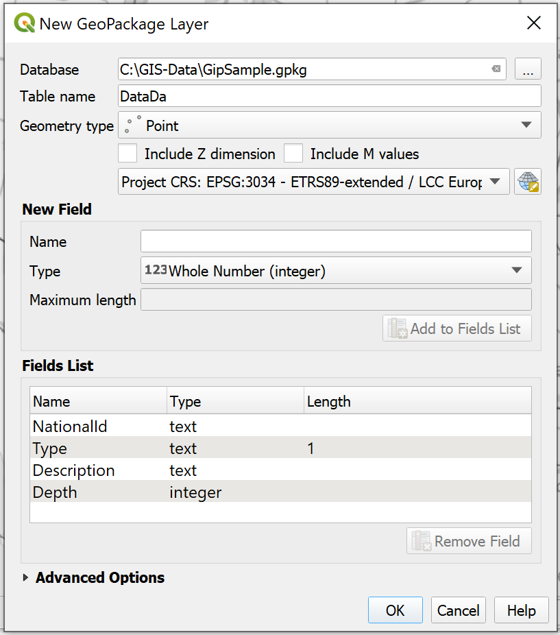

When hit OK QGIS will create a GeoPackage that only contains a table named dummy with only an id field.

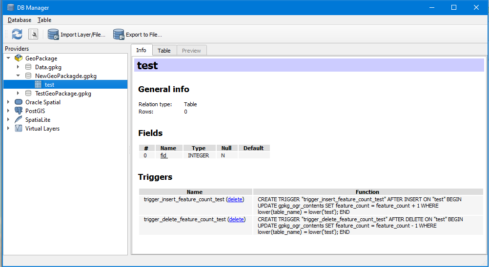

The GeoPackage is now ready and you can add your data to it.

## How to store thematisation in a GeoPackage

When you are setting up data for the EGDI platform you also need to think about how your data should be represented on the EGDI platform. This involves the representation of points on the map, how they should be coloured and based which part of the data. The best way to pass this information to the EGDI platform is to set up the thematisation in QGIS and store the thematisation in the GeoPackage.

To thematise the layer, you have to right click on the layer in and select "<ins>P</ins>roperties..."

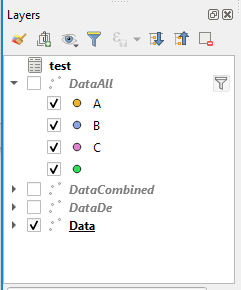

From the Layer properties dialogue select “Symbology”. To show the points of the layer coloured after one of the properties:

1. Select Categorized
2. Select the value to base the categorisation on. In this example “Text”
3. Press the “Classify” button and then the “Ok” button

Now you have a layer where your data are coloured base on the content of the field.

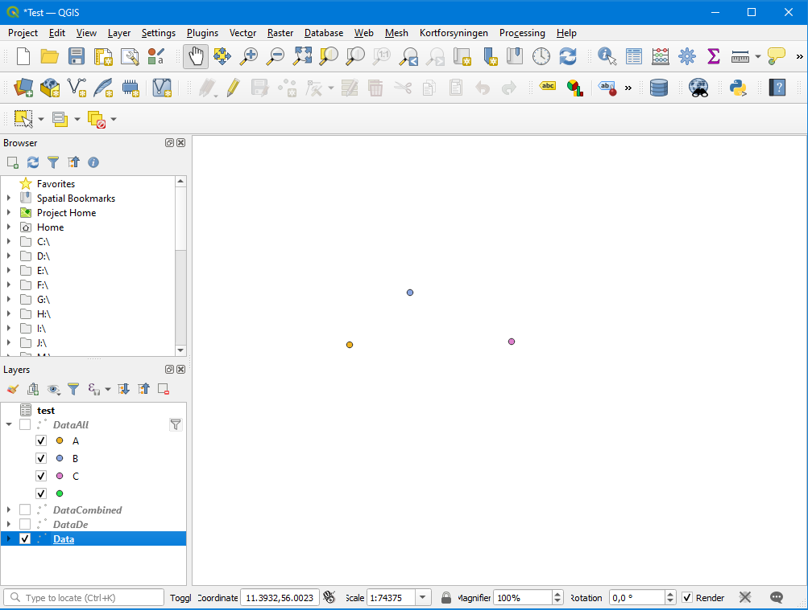

To save the symbolisation in the GeoPackage, return to the symbology property menu, press the “Style” drop down menu, and select “Save Style…”

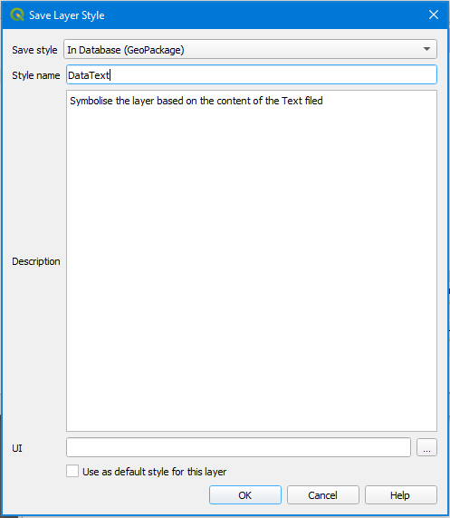

1. Select Save style “In Database (GeoPackage)
2. Name the style after the layer it is made for
3. Describe the symbolisation

Now if you go back to the DM Manager and look on the GeoPackage you can see a new table named “layer_style”. This table contains the newly created symbolisation.

Within this table the thematisation are stored in the field styleSLD on the [OGC Styled Layer Description format](https://www.ogc.org/standards/sld).

The following example of an SLD is the one that defines the thematisation used in [How to store thematisation in a GeoPackage](#how-to-store-thematisation-in-a-geopackage)

```xml
<?xml version=""1.0"" encoding=""UTF-8""?>
<StyledLayerDescriptor xmlns=""http://www.opengis.net/sld"" xsi:schemaLocation=""http://www.opengis.net/sld http://schemas.opengis.net/sld/1.1.0/StyledLayerDescriptor.xsd"" xmlns:ogc=""http://www.opengis.net/ogc"" xmlns:se=""http://www.opengis.net/se"" version=""1.1.0"" xmlns:xsi=""http://www.w3.org/2001/XMLSchema-instance"" xmlns:xlink=""http://www.w3.org/1999/xlink"">
 <NamedLayer>
  <se:Name>DataAll</se:Name>
  <UserStyle>
   <se:Name>DataAll</se:Name>
   <se:FeatureTypeStyle>
    <se:Rule>
     <se:Name>A</se:Name>
     <se:Description>
      <se:Title>A</se:Title>
     </se:Description>
     <ogc:Filter xmlns:ogc=""http://www.opengis.net/ogc"">
      <ogc:PropertyIsEqualTo>
       <ogc:PropertyName>Text</ogc:PropertyName>
       <ogc:Literal>A</ogc:Literal>
      </ogc:PropertyIsEqualTo>
     </ogc:Filter>
     <se:PointSymbolizer>
      <se:Graphic>
       <se:Mark>
        <se:WellKnownName>circle</se:WellKnownName>
        <se:Fill>
         <se:SvgParameter name=""fill"">#f0b322</se:SvgParameter>
        </se:Fill>
        <se:Stroke>
         <se:SvgParameter name=""stroke"">#232323</se:SvgParameter>
         <se:SvgParameter name=""stroke-width"">0.5</se:SvgParameter>
        </se:Stroke>
       </se:Mark>
       <se:Size>7</se:Size>
      </se:Graphic>
     </se:PointSymbolizer>
    </se:Rule>
    <se:Rule>
     <se:Name>B</se:Name>
     <se:Description>
      <se:Title>B</se:Title>
     </se:Description>
     <ogc:Filter xmlns:ogc=""http://www.opengis.net/ogc"">
      <ogc:PropertyIsEqualTo>
       <ogc:PropertyName>Text</ogc:PropertyName>
       <ogc:Literal>B</ogc:Literal>
      </ogc:PropertyIsEqualTo>
     </ogc:Filter>
     <se:PointSymbolizer>
      <se:Graphic>
       <se:Mark>
        <se:WellKnownName>circle</se:WellKnownName>
        <se:Fill>
         <se:SvgParameter name=""fill"">#89a5e2</se:SvgParameter>
        </se:Fill>
        <se:Stroke>
         <se:SvgParameter name=""stroke"">#232323</se:SvgParameter>
         <se:SvgParameter name=""stroke-width"">0.5</se:SvgParameter>
        </se:Stroke>
       </se:Mark>
       <se:Size>7</se:Size>
      </se:Graphic>
     </se:PointSymbolizer>
    </se:Rule>
    <se:Rule>
     <se:Name>C</se:Name>
     <se:Description>
      <se:Title>C</se:Title>
     </se:Description>
     <ogc:Filter xmlns:ogc=""http://www.opengis.net/ogc"">
      <ogc:PropertyIsEqualTo>
       <ogc:PropertyName>Text</ogc:PropertyName>
       <ogc:Literal>C</ogc:Literal>
      </ogc:PropertyIsEqualTo>
     </ogc:Filter>
     <se:PointSymbolizer>
      <se:Graphic>
       <se:Mark>
        <se:WellKnownName>circle</se:WellKnownName>
        <se:Fill>
         <se:SvgParameter name=""fill"">#df80ce</se:SvgParameter>
        </se:Fill>
        <se:Stroke>
         <se:SvgParameter name=""stroke"">#232323</se:SvgParameter>
         <se:SvgParameter name=""stroke-width"">0.5</se:SvgParameter>
        </se:Stroke>
       </se:Mark>
       <se:Size>7</se:Size>
      </se:Graphic>
     </se:PointSymbolizer>
    </se:Rule>
    <se:Rule>
     <se:Name></se:Name>
     <se:Description>
      <se:Title>Text is ''</se:Title>
     </se:Description>
     <ogc:Filter xmlns:ogc=""http://www.opengis.net/ogc"">
      <ogc:Or>
       <ogc:PropertyIsEqualTo>
        <ogc:PropertyName>Text</ogc:PropertyName>
        <ogc:Literal></ogc:Literal>
       </ogc:PropertyIsEqualTo>
       <ogc:PropertyIsNull>
        <ogc:PropertyName>Text</ogc:PropertyName>
       </ogc:PropertyIsNull>
      </ogc:Or>
     </ogc:Filter>
     <se:PointSymbolizer>
      <se:Graphic>
       <se:Mark>
        <se:WellKnownName>circle</se:WellKnownName>
        <se:Fill>
         <se:SvgParameter name=""fill"">#28e24e</se:SvgParameter>
        </se:Fill>
        <se:Stroke>
         <se:SvgParameter name=""stroke"">#232323</se:SvgParameter>
         <se:SvgParameter name=""stroke-width"">0.5</se:SvgParameter>
        </se:Stroke>
       </se:Mark>
       <se:Size>7</se:Size>
      </se:Graphic>
     </se:PointSymbolizer>
    </se:Rule>
   </se:FeatureTypeStyle>
  </UserStyle>
 </NamedLayer>
</StyledLayerDescriptor>
```

Using SLD styling in MapServer (the software behind the EGDI portal) is experimental. If the thematisation doesn't come out right please contact us and we can thematise your data on the portal for you.

## How to define a layer based on several spatial tables

Using queries, it is possible to combine data from several tables within the GeoPackage into on layer. This technique can be used if a project wants to make editing of the data by the different partners easier and therefore store each partners data in separate spatial tables. The tables must have exactly the same structure and must use the same code lists. All tables must also have an id that is unique for the whole data set (could be language code + a local id). The best way to secure that the data tables from the different partners match each other is to create a data set with the correct structure and distribute this to the different partners. The partners can then add their data to existing table.

To make the data available as one data set create a view in the GeoPackage using a syntax like the following from the DB Managers SQL window:

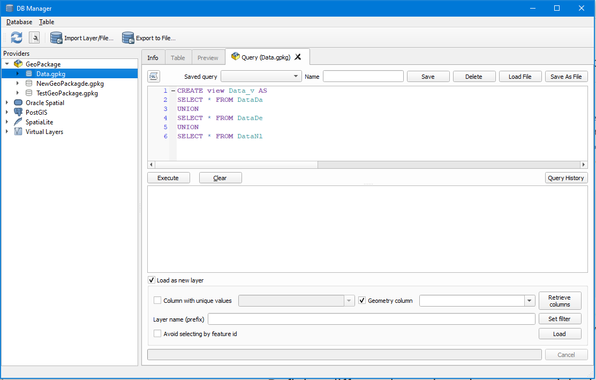

```sql
CREATE VIEW DataView AS
SELECT * FROM DataDe
UNION
SELECT * FROM DataDa
COMMIT;
```

This will make a view in the data base that combines all data from three partners into one data set. This will only work if the structure of the different partners matches each other exactly and in this way also works as a quality control of the structure of different data sets.

In order to make this view based layer work properly (as a read only layer) in QGIS you will also need to register the layer in the GeoPackage. To do this you need to execute the following SQL.

Register the table including its extend (QGIS can't calculate extend properly):

```sql
INSERT INTO gpkg_contents (table_name, data_type, identifier, description,
    min_x, min_y, max_x, max_y, srs_id )
  VALUES ('DataView', 'features', 'DataAll', 'All data', 3924861.0,
    3106824.75, 3940113.6, 3118376.0, 3034);
COMMIT;
```

Register the view as a spatial data set:

```sql
INSERT INTO gpkg_geometry_columns (table_name, column_name, geometry_type_name, srs_id, z, m)
  VALUES ('DataView', 'geometry', 'POINT', 3034, 0, 0);
COMMIT;
```

The field geometry_type_name must contain the actual geometry type for the data. The supported geometry types are:

* POINT
* LINESTRING
* POLYGON
* MULTIPOINT
* MULTILINESTRING
* MULTIPOLYGON

## Defining different layers based on one spatial table

It is also possible to crate several layers based on one spatial table. Using the same method as in the example above you can make views that defines different representations of your data set.

Suppose you have a spatial data set with boreholes and where you have a field called BoreholeUse you want to use to split the data set into two separate layers. You can then create one view to display the boreholes used for water supply using this SQL:

```sql
CREATE VIEW watersupply_v AS
  SELECT * FROM Boreholes
  WHERE BoreholeUse = 'WaterSupply';
COMMIT;
```

And then another view to display the boreholes used for monitoring  using this SQL.

```sql
CREATE VIEW monitoring_v AS
  SELECT * FROM Boreholes
  WHERE BoreholeUse = 'Monitoring';
COMMIT;
```

Both layers should be thematised and the symbolisation saved in the GeoPackage as described in the section about [storing thematisation in a GeoPackage](#how-to-store-thematisation-in-a-geopackage)

## How to store more than one spatial layer in a GeoPackage

Each data set must be delivered in separate GeoPackages and refer to their own metadata entry in EGDI Metadata Catalogue. If however a single data set contains more than one layer. You can add several spatial layers to the same GeoPackage. As the layers to be shown on the EGDI platform must only contain one geometry type this could be a data set with more than one geometry types. This could be a data set describing project areas with location of some locations within the areas. Here the project areas can be defined by polygons while the locations can be defined by points.

Creating Layers in an existing GeoPackage is done in the same way as creating a new GeoPackage. The only difference is that you select an existing GeoPackage

"<ins>L</ins>ayer" - "Create Layer" - "New GeoPackage Layer...". The only difference is that you have to give the name of an existing GeoPackage

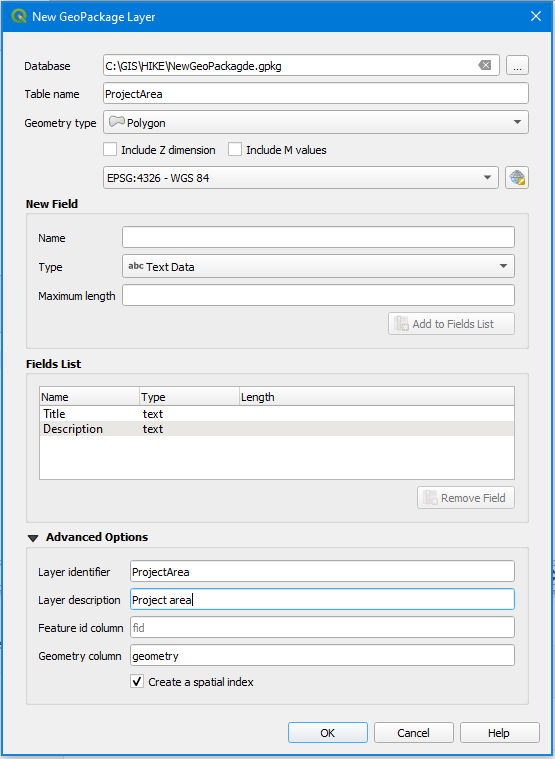

When you after defining the layer hit the OK button you are asked if you want to overwrite the existing GeoPackage or add the layer to it.

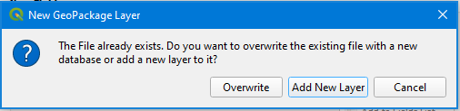

## How to link articles to a spatial table with pilot areas

The GeoERA project HOVER wanted to show their pilot areas and make documents describing the pilot ares available to the user. As the number of articles varies from site to site and can be rather long list of articles, it was not feasible to add a link to each document in a field in the attribute table.

This was accomplished by the following steps:

* First a GeoPackage with the pilot areas was created in QGIS
* From [SQLiteStudio](https://sqlitestudio.pl/)
  * A data table with room for PolygonId, URL_REF, ArticleName and OPENAccess was added to the GeoPackage
  * The list of articles was loaded into the table
  * A view linking the articles to the polygons was created
  * The content in gpkg_contents and gpkg_geometry_columns was updated to make the view apper like a spatial table

The data table vas created using this SQL:

```sql
CREATE TABLE HOVER_csv (
    ID          INTEGER PRIMARY KEY,
    FID_1       INTEGER,
    URL_REF     TEXT,
    ArticleName TEXT,
    OPENaccess  TEXT
);
```

Then the data about the articles was imported using the CSV import function in SQLiteStudio.

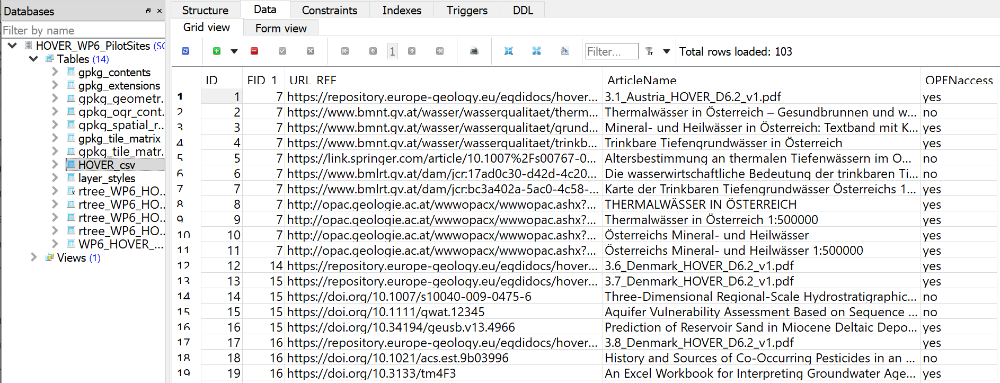

After that a view that linked articles to pilot areas was created using this SQL:

```sql
CREATE VIEW HOVER_Sites AS
    SELECT p.geom,
           p.Country,
           p.PilotName,
           p.SiteNo,
           d.URL_REF,
           d.ArticleName,
           d.OPENaccess
      FROM WP6_HOVER_PilotSites p
           JOIN
           HOVER_csv d ON p.FID_1 = d.FID_1;
```

In order to make this view look like a spatial table in the GeoPackagde, it had to be registered in the gpkg_contents and gpkg_geometry_columns (GeoPackage system tables). This was done by copying the relevant data from spatial table  (in this case from; WP6_HOVERPilotSites) that the view are based on.

In the table gpkg_contents you must add the name of the view (in this case; HOVER_Sites) in table_name and identifier fields and add a meaningful text in the description field.

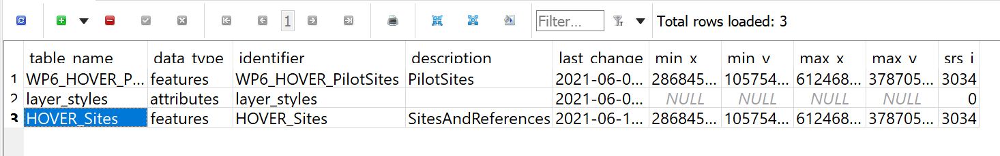

In the table gpkg_geometry_columns you must add the name in the table_name field and keep the other fields as in the record defining the original spatial table.

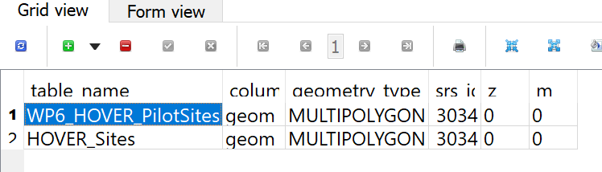

After this the GeoPackage will look like it contains two spatial tables both when opened from QGIS and when uploaded to EGDI.

During upload you must select the view (in this case; HOVER_Sites) to be imported into EGDI.

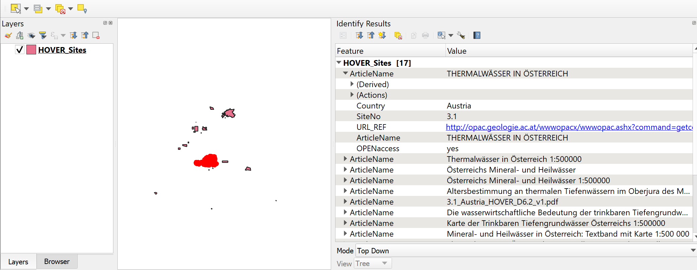

## Document Details


### Report

Authors and affiliation: GEUS

Name(s): MH

Report Name: EGDI Administration Module

Work package: WP6 and WP7

E-mail of lead author: mh@geus.dk

Version: 20/10/2020

This report is part of a project that has received funding by the European Union's Horizon 2020 research  and innovation programme under grant agreement number 731166.


Report Status: Under development
